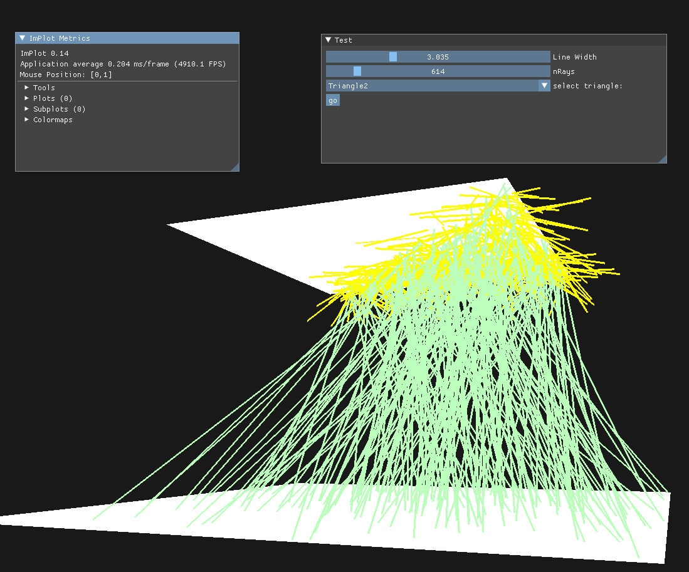

# openRayner
a wip thermal raytracer currently capable of sampling rays from triangles in the scene and visualizing them interactively in a glfw window

## dependencies for building and running
a vulkan driver, Nvidias nouveau doesnt work properly, apperently :/

### Ubuntu

    // Vulkan
    sudo apt install vulkan-tools
    sudo apt install libvulkan-dev
    // developement
    sudo apt install vulkan-validationlayers-dev spirv-tools

    // GLFW
    sudo apt-get install xorg-dev libglu1-mesa-dev

### Arch:

    // Vulkan
    sudo pacman -S vulkan-devel

    // GLFW
    sudo pacman -S glfw-wayland # glfw-x11 for X11 users

## screenshots

